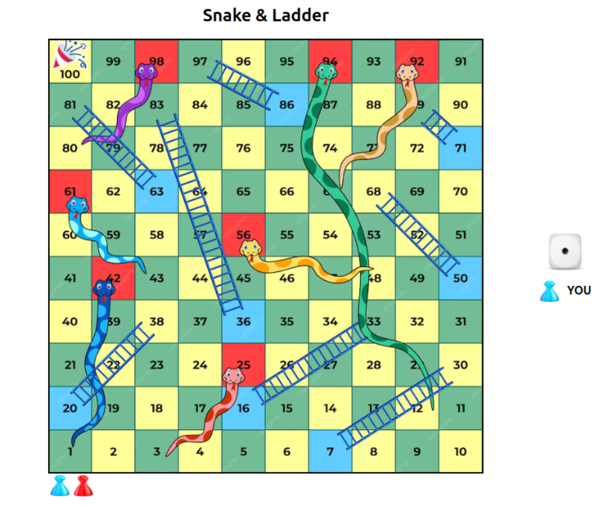

# 🎲 Snake and Ladder Game in React

This is a web-based Snake and Ladder game developed using React.js. It features a Person vs. Bot mode, smooth animations, dice roll sound effects, and a responsive design. The game follows traditional Snakes and Ladders rules, with a bot opponent that automatically rolls the dice and moves accordingly.

## 🚀 Features

- Single Player vs. AI (Bot)
- Smooth Animations for Player Movement
- Clickable Dice Roll with Sound Effects
- Dynamic Snake and Ladder Logic
- Game Win/Loss
- Fully Responsive Design (Mobile & Desktop)

## 🛠️ Technologies Used

React.js – Component-based UI structure

CSS3 – Animations and styling

JavaScript (ES6+) – Game logic and event handling

HTML5 – Structuring the game board

Audio API – Dice roll sound effects

## Screenshot



## 📦 Installation & Running the Game

1. Clone the repository:

```sh
git clone https://github.com/yourusername/snake-ladder-react.git
```

2. Navigate to the project folder:

```sh
cd snake-ladder-react
```

3. Install dependencies:

```sh
npm install
```

4. Start the development server:

```sh
npm run dev
```

5. Open your browser and visit:
   [http://localhost:5173](http://localhost:5173)
